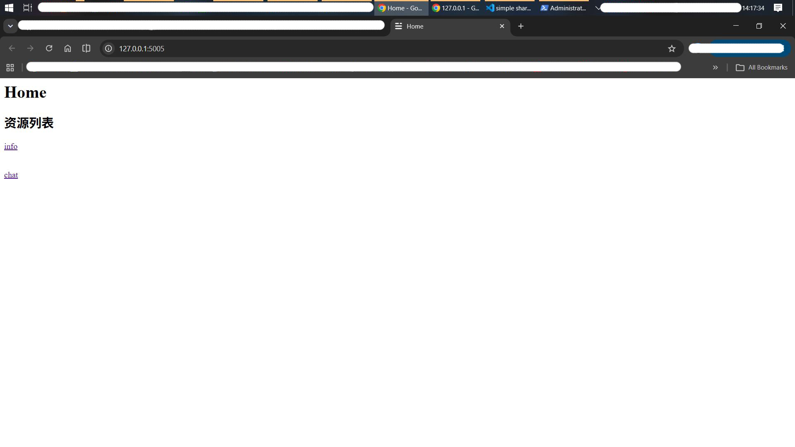
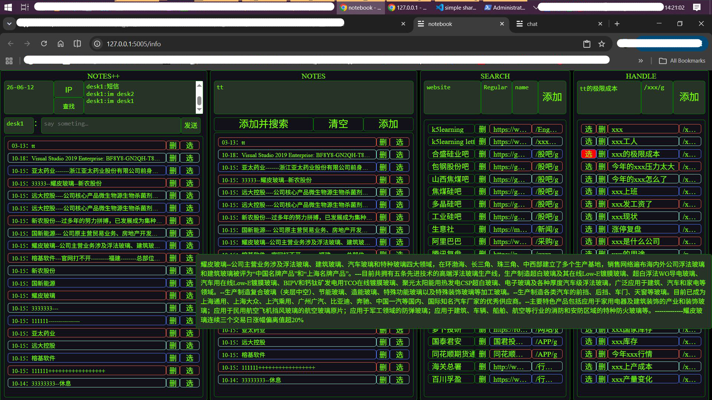
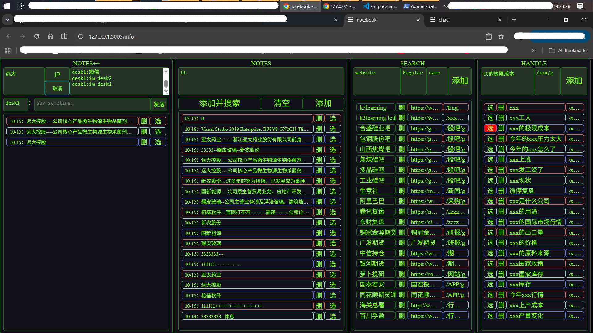
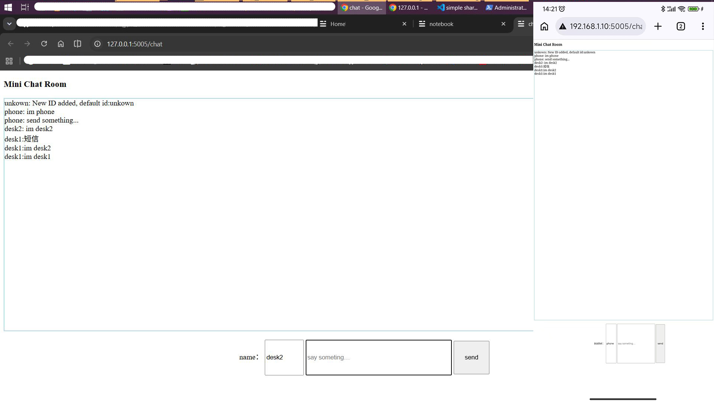
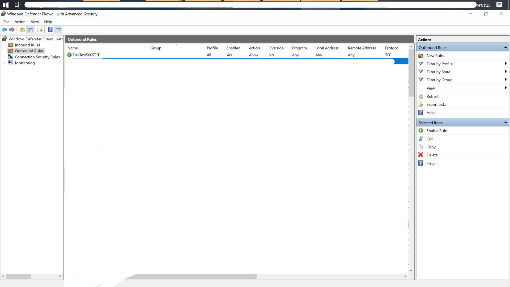

# simple-share-save-and-edit-info-and-chatting-for-individual-or-a-team-via-local-network
# 简单的 通过本地局域网进行个人或团队之间的信息分享保存编辑和交流

项目借助了KIMI AI，作为辅助。
This project was assisted by KIMI AI.

The readme document was manually written after a six-month interval and may not match the actual situation, It cannot be regarded as 100% correct.
readme文档为时隔半年后手动书写，可能与实际存在或者错别字，不能视为百分百正确。

---

## Quick Start
## 快速运行

Download all project files locally without changing the directory structure, ensuring all Python third-party dependencies are installed, and wor well.
将本项目所有文件，不动结构，下载至本地，在确保Python第三方库的依赖已经安装且正确。

make sure that flask and flask-socketio's versions are matched, or program may not work well，and trough errors.
确保flask和flask-socketio的版本匹配良好，否则运行可能出问题

**Note that the inlet and outlet ports of 5005 on the host's firewall should be open;
 otherwise, other devices in the local area network cannot connect
**注意，主机的防火墙的5005的进出端口应当处于打开状态，否则局域网的其他设备不能进行连接

**Note that the project is not secure enough without dedicated encryption work. Be sure to pay attention when transmitting and saving confidential information. Further development can be carried out to make it secure enough or to ensure that the local network is secure enough.
**注意，项目未进行专门的加密工作，是不够安全的，传输和保存机密信息时，务必注意。可进行进一步开发使其足够安全或者确保本地网络足够安全。

****in short, pay attention to usage safety and information security
****总之注意使用安全，信息安全

Method 1: Run `python Info System server.py` directly.
This is the most essential way of operation. If other methods fail, use this method directly.
方法一：直接python运行Info System server.py 这是最本质的运行方法。如果其他方法失败则直接使用这个方法。

Method 2: Double-click `runApp.vbs` to run. The script will automatically run the server locally and automatically open the navigation page.
方法二：双击运行runApp.vbs脚本，直接运行。脚本会自动运行服务器在本地，且自动打开导航页。

运行起来后，可打开浏览器访问：http://127.0.0.1:5005 访问home导航页面
After running, open your browser and visit: http://127.0.0.1:5005 to access the home navigation page.

---

## Features
## 功能特性

- -------CHAT
-  **团队交流**：可在不停设备间进行交流

- -------INFO
-  **Note Taking**: Record notes in the RESOURCE section. Search functionality can be further developed.
-  **记录笔记**：可记录笔记，即RESOURCE部分。可进一步开发查找等功能。

-  **Content Replacement**: The HANDLE section performs simple replacement on notes using regular expressions. Generally for simple substitutions only.
-  **对笔记内容进行替换处理**：HANDLE部分可对笔记进行简单替换处理，根据正则表达式进行处理。一般只是简单替换

-  **Quick Search**: In the SEARCH section, click a content title to open in a new tab and search using the processed content from HANDLE as keywords. For example, search for content related to keywords within one month.
-  **进行快捷搜索**：search部分，点击其中内容的标题，在新标签页打开，并根据handle处理出来的内容作为关键字进行查询。比如搜索一个月内与关键字相关的内容。

-  **Updatable**: Supports add/delete/query operations, with results stored in the MData database.
-  **可更新**：可进行增删查操作，结果存在数据库MData。

---

## Tech Stack
## 技术栈

| 类别 | 技术 |
| Category | Technology |
|----------|------------|
| Backend | Python, Flask, SQLite, python-socketIo|
| 后端 | Python，Flask，SQLite，python-socketIo|
| Frontend | JavaScript, HTML5 Canvas |
| 前端 | JavaScript，HTML5 Canvas |

### Environment Requirements
### 环境要求

- Python 3.11+
- Ensure that the corresponding support and dependencies are working properly.
- 确保相应的的支持和依赖工作正常。

---

## Screenshots
## 截图

### HOME Page
### HOME页面

### NOTE Page
### NOTE页面

### CHAT Page
### CHAT页面

### Configure the firewall
### 配置防火墙

---

## License
## 许可证

This project is open-sourced under the [MIT License](LICENSE).
本项目采用 [MIT 许可证](LICENSE) 开源。

Copyright (c) 2026 gikmoogie

---

## Contact
## 联系方式

- GitHub: [@gikmoogie](https://github.com/gikmoogie)

---
> Any questions, please feel free to contact. reply when i see it
> 有任何问题可联系，看到会回复
> This project is currently on hold. Feel free to reach out with any questions or feedback!
> 项目处于搁置状态，如有问题欢迎联系反馈！
